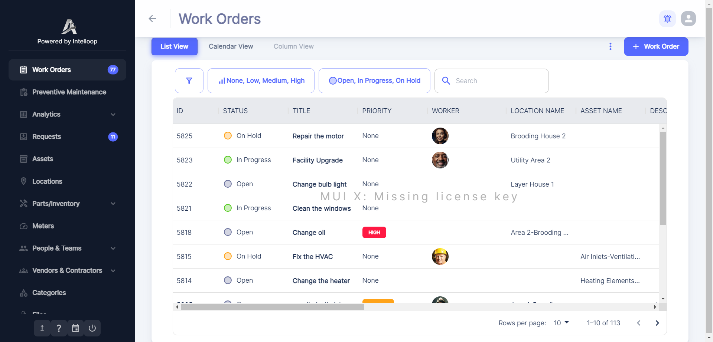

<p align="center"></p>
<h1 align="center">Atlas CMMS</h1>

[Atlas CMMS](https://github.com/grashjs/cmms) is a powerful, self-hosted maintenance management system designed for both
web and mobile platforms using Docker. It simplifies and automates the management of maintenance activities, making it
ideal for IT managers or developers looking to implement solutions that keep their organization's assets running smoothly.
Think of it like **Jira for technicians**.

**Example industries**

- Facilities Managers (buildings, property, real estate)
- Manufacturing/Production Teams (machinery and equipment)
- Healthcare Facilities (medical equipment maintenance)
- Hospitality Managers (hotels and resorts)
- Public Sector (infrastructure and public buildings)
- Educational Institutions (campus maintenance)
- Utility Companies (power, water, and energy systems)

**Screenshots**:
<div align="center">




</div>

## ⚡ **Features**

### Work Orders & Maintenance

- 📝 Create, assign, and track work orders.
- ⏱️ Log time, set priorities, and track history.
- 🤖 Automate work orders with triggers.
- 📊 Export reports and view analytics.

### Analytics & Reporting

- 💼 Work order compliance and cost analysis.
- 🛠️ Equipment downtime and reliability insights.
- 💵 Cost trends and labor tracking.

### Equipment & Inventory

- ⚙️ Track equipment, downtime, and maintenance costs.
- 📦 Manage inventory with stock alerts.
- 🛒 Automate purchase orders and approvals.

### User & Workflow Management

- 👥 Assign tasks to teams or service providers.
- 🧑‍💼 Customizable user roles and permissions.
- 🔄 Define workflows with automation logic.

### Locations & Requests

- 📍 Manage locations with Google Maps integration.
- 📑 Create and track service requests.

You can check out the [complete list of features](api/Current%20features.pdf).

We'd love to have **new contributors**, so feel free to join us!  
⭐ **Star this repo to support us!**

## Self Host / Run locally

#### Clone the Repository

```sh
git clone https://github.com/grashjs/cmms.git
cd cmms
```

### Set environment variables

Configure the environment variables in this file [.env](.env)
At the moment all variables are optional. Do not delete the .env file

| Name                         | Required | Description                                                                                                                                                                                                         | Default Value         |
|------------------------------|----------|---------------------------------------------------------------------------------------------------------------------------------------------------------------------------------------------------------------------|-----------------------|
| SMTP_PWD                     | No       | The SMTP password after creating an app password with Google. [Learn how to create an app password](https://support.google.com/accounts/answer/185833?hl=en). To be able to invite people you have to configure it. | (empty)               |
| SMTP_USER                    | No       | The SMTP username after creating an app password with Google. [Learn how to create an app password](https://support.google.com/accounts/answer/185833?hl=en)                                                        | (empty)               |
| JWT_SECRET_KEY               | No       | JWT secret key                                                                                                                                                                                                      | your_jwt_secret       |
| REACT_APP_GOOGLE_KEY         | No       | Google Maps API key                                                                                                                                                                                                 | (empty)               |
| REACT_APP_GOOGLE_TRACKING_ID | No       | Google Analytics tracking ID                                                                                                                                                                                        | (empty)               |
| PUBLIC_FRONT_URL             | No       | Frontend URL in this format `http://your.public.ip:3000`                                                                                                                                                            | http://localhost:3000 |
| PUBLIC_API_URL               | No       | Public API URL in this format `http://your.public.ip:8080`                                                                                                                                                          | http://localhost:8080 |
| STORAGE_TYPE                 | No       | Type of storage either local MinIO or Google Cloud Storage `gcp` or `minio`                                                                                                                                         | minio                 |
| PUBLIC_MINIO_ENDPOINT        | No       | Public Mini endpoint in format `http://public.ip:9000`                                                                                                                                                              | http://localhost:9000 |
| GCP_JSON                     | No       | The Google Cloud JSON key after following [these instructions](./GCP-setup.md).                                                                                                                                     | (empty)               |
| GCP_PROJECT_ID               | No       | The Google Cloud project ID, also found in the `GCP_JSON` file.                                                                                                                                                     | (empty)               |
| GCP_BUCKET_NAME              | No       | GCP Bucket Name                                                                                                                                                                                                     | (empty)               |
| MAIL_RECIPIENTS              | No       | Comma-separated email addresses of the super admins where to send information emails like new signups. You can provide your email address.                                                                          | (empty)               |
| REACT_APP_MUI_X_LICENSE      | No       | Mui Pro license key                                                                                                                                                                                                 | (empty)               |
| FASTSPRING_PWD               | No       | FastSpring password. Fastspring is a payment gateway                                                                                                                                                                | (empty)               |
| FASTSPRING_USER              | No       | FastSpring username                                                                                                                                                                                                 | (empty)               |
| SPRING_PROFILES_ACTIVE       | No       | Active Spring profile(s)                                                                                                                                                                                            | (empty)               |

After changing any env variable starting with `REACT_APP_` or `PUBLIC_API_URL` you should run  `docker compose up -d --no-deps --build`

#### For remote servers

- You need to update every env variable starting with `PUBLIC_`.
- You must also update every env variable starting with `SMTP`.
- Open ports if necessary: make sure to open `REACT_APP_API_URL`, `PUBLIC_FRONT_URL` ports numbers by default
8080, and 3000. Same for `PUBLIC_MINIO_ENDPOINT` port 9000 if you use Minio.

### Run

```sh
docker-compose up -d
```

Now, go to http://localhost:3000 or your custom `PUBLIC_FRONT_URL`

Celebrate on how easy this was

## Getting help

### Docs

https://grashjs.github.io/user-guide

If you still have questions after reading the docs, concerns, bug reports, etc, please file an issue in this
repository's Issue Tracker or send an
email at [ibracool99@gmail.com](mailto:ibracool99@gmail.com).

## Supported languages

- English
- Spanish
- French
- Turkish
- Portuguese (Brazil)

## 🏗️ **Tech Stack**

- [Api](api) with java Spring Boot
- [Website](frontend) with React/Typescript
- [Mobile](mobile) with React Native.

## Need Professional Help?

Don't want to handle the maintenance and management yourself? We offer a complete done-for-you
service. [Please reach out to us](mailto:ibracool99@gmail.com)

## 🤝 Looking to contribute?

We welcome contributions! You can help by:

- ✅ Reporting bugs
- ✅ Suggesting new features
- ✅ Improving documentation
- ✅ Submitting pull requests

Check CONTRIBUTING.md inside each subproject for details.

You can also join our [Discord server](https://discord.gg/A6eMSNwg)

## Open source licensing info

1) [LICENSE](LICENSE)
